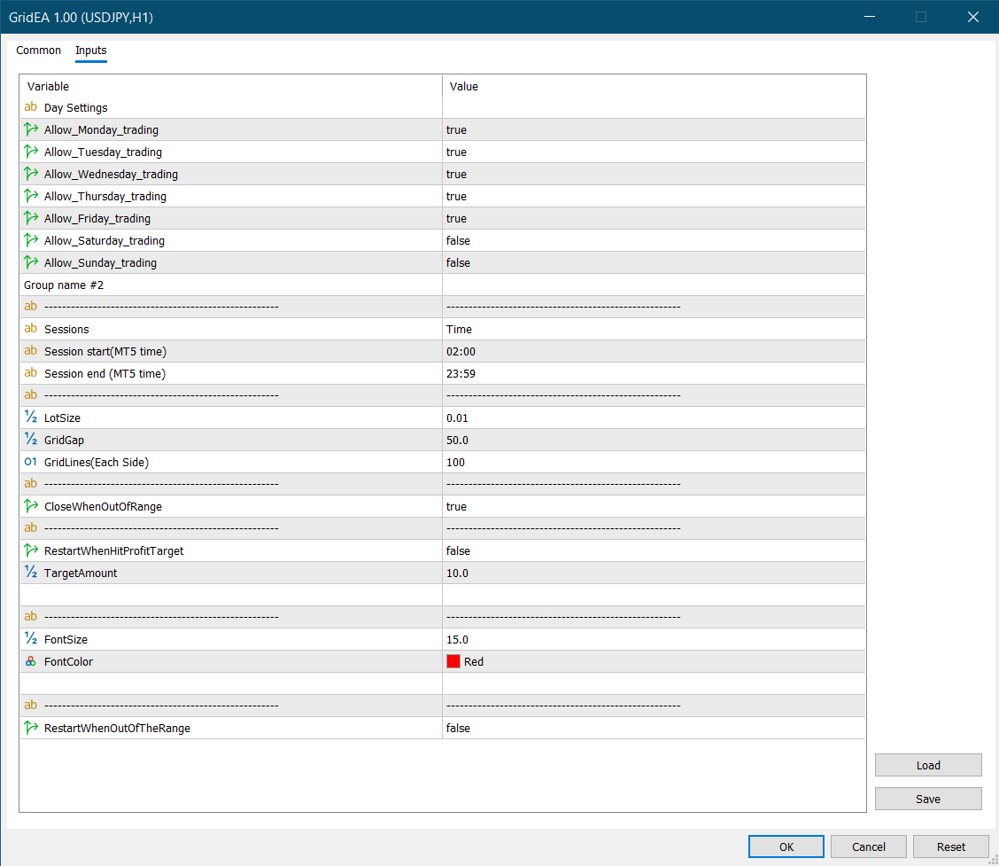
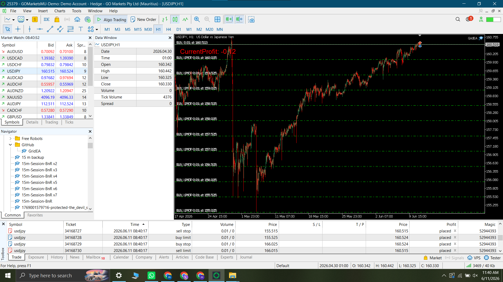

# Grid-EA

A MetaTrader 5 Grid Expert Advisor designed for sideways/ranging markets.

The EA places buy and sell orders at defined grid levels and includes range-based controls, profit-target restart, trading day/time filters, and on-chart running profit display.

> ⚠️ This project is for educational and portfolio demonstration purposes only. Trading involves risk. Past performance does not guarantee future results.

---

## Overview

Grid-EA is an MQL5 Expert Advisor that demonstrates structured grid trading logic for MetaTrader 5.

It is designed to show how an EA can manage multiple trades, monitor floating profit, apply trading filters, and close or restart trading cycles based on predefined rules.

This EA is mainly suitable for sideways or range-bound market conditions.

---

## Key Features

* Grid-based buy and sell trade placement
* Configurable grid levels
* Trading day filter
* Trading time filter
* Price range control
* Optional close/stop when price moves outside range
* Floating profit target close
* Automatic restart after profit target is reached
* On-chart running profit display
* Magic number based trade management
* MetaTrader 5 / MQL5 implementation

---

---

## Screenshots

### EA Input Settings



### Grid Chart Preview



### Strategy Tester Graph


### Strategy Tester Report


---

## Backtest Note

The strategy tester screenshots are provided for demonstration purposes only.

Backtest results depend on symbol, timeframe, broker conditions, spread, commission, market behavior, and input settings. These results should not be considered financial advice or a guarantee of future performance.

## How It Works

The EA works around predefined grid levels.

When price reaches selected grid levels, the EA can place buy or sell trades depending on the configured logic.

The EA monitors the total running profit of active trades.

When the floating profit target is reached, it can close all active trades and restart the operation.

If price moves outside the allowed trading range, the EA can stop or close the operation depending on the selected settings.

---

## Best Use Case

This EA is best used for:

* Sideways market testing
* Range-bound trading logic
* Grid strategy research
* MQL5 trade management demonstration
* Portfolio showcase

It is not designed as a guaranteed profit system.

---

## Installation

1. Download the `GridEA.mq5` file.
2. Open MetaTrader 5.
3. Go to:

```text
File > Open Data Folder > MQL5 > Experts
```

4. Copy `GridEA.mq5` into the `Experts` folder.
5. Restart MetaTrader 5 or refresh the Navigator panel.
6. Attach the EA to a chart.
7. Enable Algo Trading.

---

## Risk Warning

Grid strategies can be risky because they may open multiple trades and increase exposure during strong trending markets.

Use this EA only for testing, learning, and demonstration unless you fully understand the risks.

The developer is not responsible for any trading losses.

---

## Developer

**MubinCodes**
Software Developer specializing in MQL4/MQL5 trading bots, custom indicators, Python automation, and financial software.

GitHub: https://github.com/MubinCodes
Fiverr: https://www.fiverr.com/mubinbhaiya?public_mode=true
